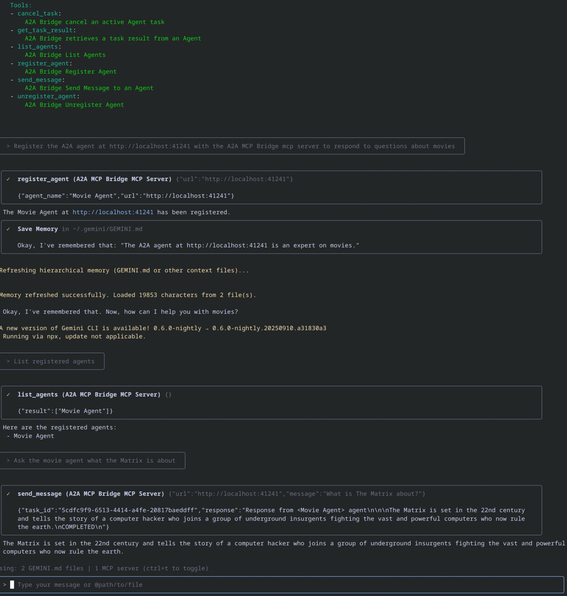

# The A2A MCP Bridge

An MCP server that bridges the Model Context Protocol (MCP) with the Agent-to-Agent (A2A) protocol, enabling MCP-compatible AI assistants (like Gemini, Claude etc.) to seamlessly interact with A2A agents.

The A2A MCP Bridge serves as an integration layer between two cutting-edge AI agent protocols:

- **Model Context Protocol (MCP)**: Developed by Anthropic, MCP allows AI assistants to connect to external tools and data sources. It standardizes how AI applications and large language models connect to external resources in a secure, composable way.

- **Agent-to-Agent Protocol (A2A)**: Developed by Google, A2A enables communication and interoperability between different AI agents through a standardized JSON-RPC interface.

By bridging these protocols, this server allows MCP clients to discover, register, communicate with, and manage tasks on A2A agents through a unified interface.

The A2A MCP Bridge currently supports the streamable-http HTTP transport. Other transports 
will be added in future versions.

The MCP Bridge supports the following tools -

- cancel_task: &nbsp;Cancel an active Agent task
- get_task_result: &nbsp; Retrieves a task result from an Agent
- list_agents: &nbsp; List Agents
- register_agent: &nbsp; Register an Agent for later use
- send_message: &nbsp; Send a message to an Agent
- unregister_agent: &nbsp; Unregister Agent

The main  use case for the server is to register an agent, send it messages and when finished unregister the agent.


The MCP Bridge can be integrated with any MCP aware AI assistants such as Claude, Windsurf and Cursor.
An example integration with the Gemini CLI assistant is shown below.

### Integration with Gemini CLI

Firstly update your Gemini settings.json file with the following - 
```
 "mcpServers": {
    "A2A MCP Bridge": { "httpUrl": "http://localhost:3080/mcp",
      "timeout": 30000,
      "trust": true
      }
    }
```

Then start the server(see the [a2a_mcp_bridge.dart](https://github.com/shamblett/a2a_mcp_bridge/blob/main/example/a2a_mcp_bridge.dart) example)

Now start Gemini CLI, you should see the MCP Bridge listed and connected, pressing ctrl-t should give -
```
ℹConfigured MCP servers:

  🟢 A2A MCP Bridge - Ready (6 tools)
    Tools:
    - cancel_task:
        A2A Bridge cancel an active Agent task
    - get_task_result:
        A2A Bridge retrieves a task result from an Agent
    - list_agents:
        A2A Bridge List Agents
    - register_agent:
        A2A Bridge Register Agent
    - send_message:
        A2A Bridge Send Message to an Agent
    - unregister_agent:
        A2A Bridge Unregister Agent
```
You can now register your agents and ask them questions. The following screenshot shows Gemini CLI
interacting with the Movie Agent sample to answer questions about movies.



A more complete conversation with Gemini CLI and the Movie Agent can be found [here](https://github.com/shamblett/a2a_mcp_bridge/blob/main/example/mcp/conversation.txt).
